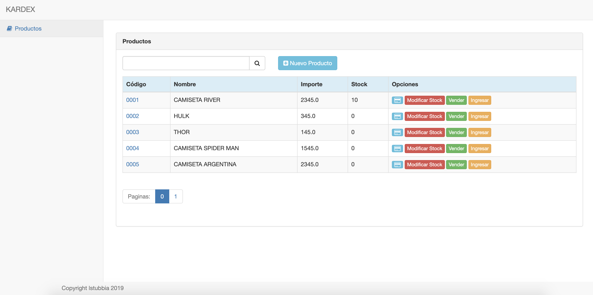
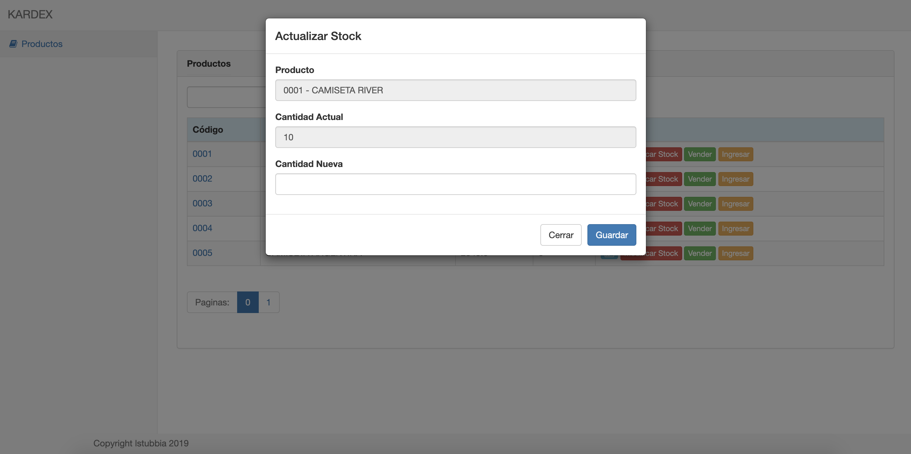
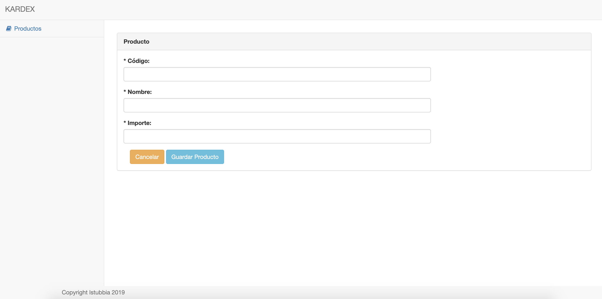

kardex
-------
Crear un sistema kardex que controle nuestros productos, incremente con el registro de nuevos
productos y disminuya con la salida de los mismos, además que nuestro vendedor realice cambios esas
cantidades a través de las interfaces correspondientes. Importante aclarar que cuando un producto no
tenga stock no permita realizar movimientos con él.

# tecnologias:
- Spring boot
- Spring Data
- String Actuator
- [Thymeleaf](http://www.thymeleaf.org) + webjar + layout
- Boostrap - UI template
- H2 - db in memory
- JUnit5

## Run ##

Ejecutar la aplicación. Necesitas compilar el proyecto: `mvn clean package`
```
java -jar Kardex-1.0.jar
```
o mediante maven:
```
mvn spring-boot:run
```
Ejecutar los test:
```
mvn test
```
La aplicación utiliza H2 `h2:~/kerdexdb;`.
Endpoint a la base: `http://localhost:8080/h2-console`

## Uso ##

* WEB UI
```
- home: http://localhost:8080
- productos: http://localhost:8080/product
- paginado de productos: http://localhost:8080/product?page={pageNbr}
- producto: http://localhost:8080/product/new
- Movimientos: http://localhost:8080/product/{prodId}/movement

```
* REST endpoints (metrics)

```
- Stock: http://localhost:8080/stock/{stockId}
- Actuator: http://localhost:8080/actuator
- Health: http://localhost:8080/actuator/health
```
[Actuator: Resto de endpoints](https://docs.spring.io/spring-boot/docs/current/reference/html/production-ready-endpoints.html)

## UI ##
* Home/Product:

* Actualizacion de Stock (RESET/VENTA/INGRESO):

* Creación/Actualización de Productos:

